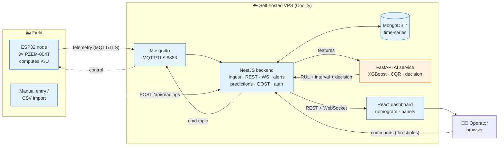
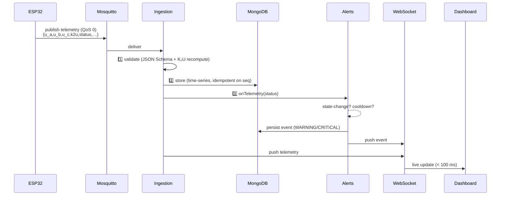
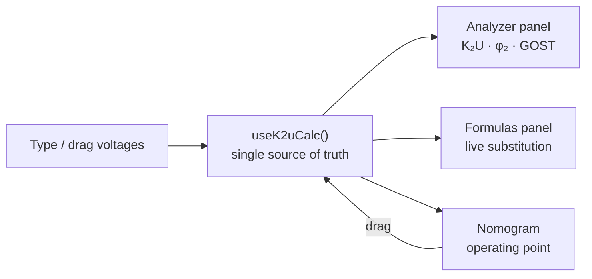
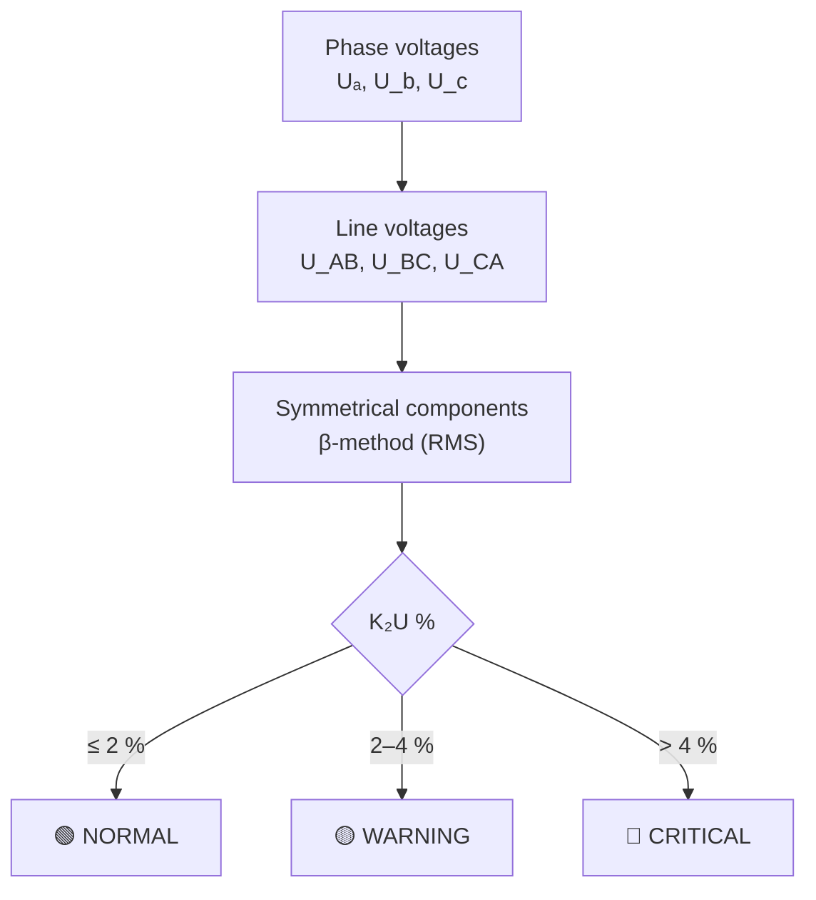
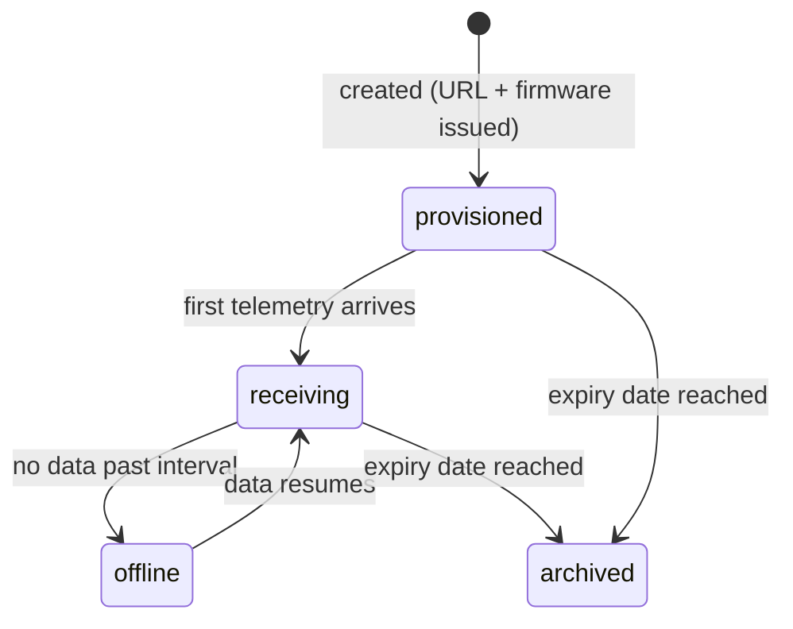
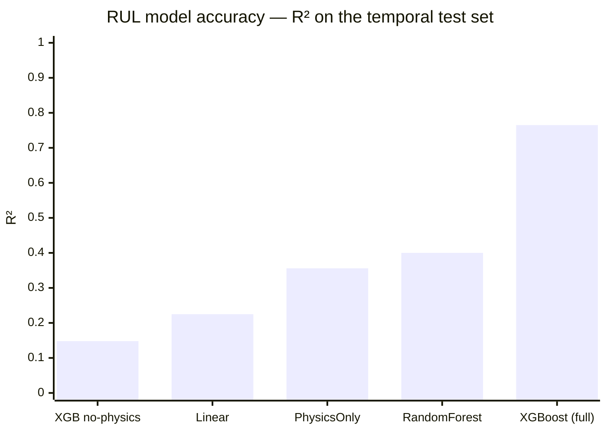
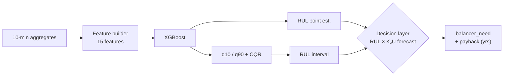
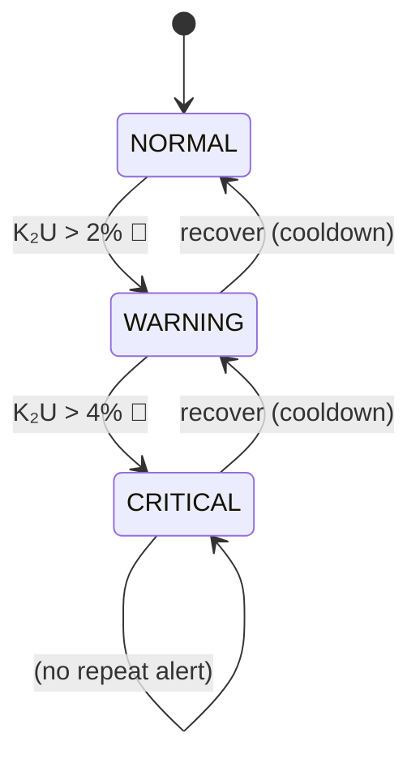
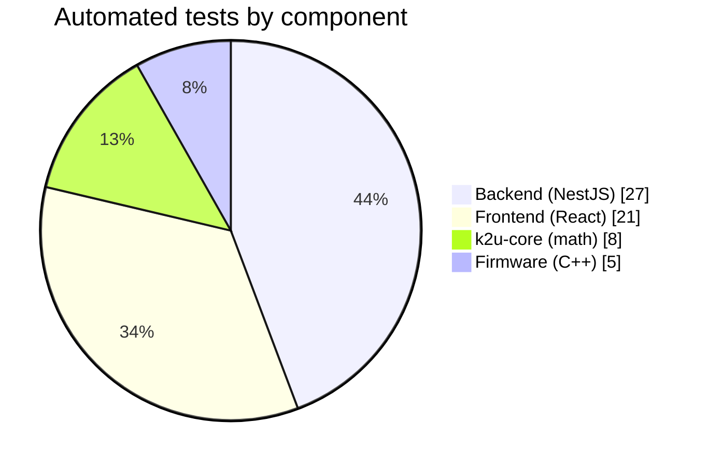

<div align="center">

# ⚡ K₂U Platform

### Remote monitoring of three-phase **voltage unbalance** with AI-based equipment life prediction

Measure the negative-sequence voltage unbalance factor **K₂U** on renewable-energy (PV inverter)
and telecom sites, visualize it on a live **polar nomogram**, evaluate **GOST 32144-2013**
compliance, and predict each device's **Remaining Useful Life (RUL)** with a conformal, explainable ML model.


</div>

> Implements the system described in the author's PhD dissertation and Scopus manuscript.
> The core K₂U math is implemented and **cross-verified in three languages** — TypeScript, C++
> and Python — agreeing to better than 0.001 %.

<div align="center">

### 🌐 [**Live demo →**](http://sw5vygcfeb34qjhkk6hklusv.178.105.41.164.sslip.io)

Public, no login required. Two simulated ESP32 devices stream ~2 months of physics-based data that
reproduces the paper's results. Every graph exports as **vector SVG** or **high-res PNG** for figures.

</div>

---

## Table of contents

- [What it does](#what-it-does)
- [Architecture](#architecture)
- [How data flows](#how-data-flows)
- [The dashboard](#the-dashboard)
- [The K₂U nomogram](#the-k2u-nomogram)
- [Devices & firmware](#devices--firmware)
- [AI: RUL prediction](#ai-rul-prediction)
- [Alert state machine](#alert-state-machine)
- [Tech stack](#tech-stack)
- [Monorepo layout](#monorepo-layout)
- [Quick start](#quick-start)
- [Testing & verification](#testing--verification)
- [Deployment](#deployment)
- [Roadmap](#roadmap)

---

## What it does

| | Capability |
|---|---|
| 📟 | **Measures** three phase-to-neutral voltages on a 4-wire 380/220 V supply via 3× PZEM-004T on an ESP32, and computes K₂U in real time (IEC 61000-4-30 RMS method). |
| 📡 | **Streams** telemetry over MQTT/TLS with store-and-forward, ingested by a NestJS pipeline into MongoDB time-series collections. |
| 🎯 | **Visualizes** K₂U on a live polar nomogram (magnitude × phase angle) against the 2 % / 4 % GOST limits, plus 24-h charts and a compliance panel. |
| 🧠 | **Predicts** each device's Remaining Useful Life with an XGBoost model + conformal prediction intervals + a balancer-need decision layer. |
| 🚨 | **Alerts** on GOST-band transitions (Telegram + dashboard), with cooldown to prevent flapping. |
| ✍️ | **Works without hardware** — manual data entry + CSV import feed the exact same pipeline. |
| 🧮 | **Explains itself** — an interactive K₂U analyzer recomputes the symmetrical-components and RMS β-method formulas live from any voltages you type or drag on the nomogram. |
| 📄 | **Exports** GOST compliance reports to PDF / CSV / ZIP, and every dashboard graph to **vector SVG** or **high-res PNG** for papers. |

---

## Architecture

Two logical planes are kept separate (data-plane vs control-plane), with an AI sidecar — exactly
as specified in the dissertation (BOB II–IV).



Only ports **443** (HTTPS/WSS) and **8883** (MQTT/TLS) are exposed publicly; the database and AI
service stay on the internal Docker network.

---

## How data flows

A single telemetry packet, from sensor to screen:



---

## The dashboard

A React/MUI single-page app in **light and dark themes**, built to read as a finished product for
thesis and journal figures. It is public by default (no login) — a per-user toggle hides or shows
device coordinates, while all measurement data stays visible.

| Area | What you get |
|---|---|
| **Overview** | Fleet stat cards (worst K₂U, sites in compliance, active alerts), the live nomogram beside the interactive analyzer, a full-width **Formulas** block, plus operating-point, RUL, GOST and voltage/K₂U time-series panels. |
| **K₂U analyzer** | Type phase **or** line voltages (or drag the nomogram) and watch K₂U, φ₂, the GOST verdict and the ratio read-outs update instantly. "Load unbalanced example" seeds a textbook case. |
| **Formulas** | The symmetrical-components derivation and the RMS β-method, each **substituted with your current numbers** — the equation and the result side by side, at readable width. |
| **Figure export** | A camera button on every graph saves it as **vector SVG** (best for papers / dropping into a prompt) or a 2× **PNG** — capturing the graph's exact on-screen state. |
| **Research** | Interactive, reproducible versions of the Scopus figures (RUL accuracy, measurement accuracy, ablation) with their own export. |
| **Setup** | An ESP32 wiring/Fritzing guide, per-device firmware download, and install instructions. |



---

## The K₂U nomogram

K₂U — the **negative-sequence voltage unbalance factor** — is the single quantity the whole
platform revolves around (hence the name). It is displayed on a **polar nomogram**: the radius is
K₂U (%), the angle is the negative-sequence phase φ₂, and concentric rings mark the GOST limits.
The operating point is **draggable** — moving it feeds voltages back into the analyzer (educational
inverse mode), and a faint trail shows the selected device's recent history.



> The forward/inverse transform round-trips to `<1e-7`, and the same math is implemented in
> `packages/k2u-core` (TS), `apps/firmware/lib/k2u` (C++) and `apps/ai-service` (Python).

---

## Devices & firmware

Registering a device generates a **unique dashboard URL** (`/devices/{DEV_ID}`) and a **matching
firmware bundle** in one step — so a flashed ESP32 shows up at its own page automatically, no
manual config. The generated `config.h` / `secrets.h` are pre-filled with the device's ID, site,
MQTT topic (`site/{SITE_ID}/dev/{DEV_ID}/telemetry`) and reporting interval.



Every device is fully editable at any time (name, coordinates, rated power, energy, reporting
period, expiry) and deletable. The two built-in **simulated** devices — a PV inverter site and a
telecom site — publish hourly and reproduce the paper's weekly-p95 K₂U (≈3 % PV, ≈4.3 % telecom)
and RUL results, so the whole platform is explorable end-to-end without any hardware.

---

## AI: RUL prediction

An XGBoost regressor predicts relative Remaining Useful Life from 15 unbalance/thermal features,
trained on physics-generated aging trajectories (Miner's rule + Montsinger/Arrhenius thermal life).
The numbers below are the **actual results reproduced from the Scopus simulation**.



| Metric | Value | Note |
|---|---|---|
| XGBoost R² (test) | **0.765** | PV 0.721 · telecom 0.791 |
| Ablation R² (no `cum_damage_index`) | 0.148 | physics augmentation is load-bearing |
| CQR interval `q̂` | 0.072 | calibrated 80 % coverage → 0.78 |
| Balancer-decision accuracy | **0.951** | 3-level: none / recommended / required |
| Inference | ≈ 2.2 µs/sample | |

Top features by gain: `cum_damage_index` (0.35), `exposure_2pct_30d` (0.17), `service_age` (0.10).



---

## Alert state machine

Alerts fire only on GOST-band **transitions** — escalations always, recoveries after a cooldown.



---

## Tech stack

| Layer | Technology |
|---|---|
| Firmware | ESP32 · Arduino/PlatformIO · FreeRTOS · PZEM-004T · MQTT/TLS |
| Broker | Eclipse Mosquitto 2 (TLS + per-device ACL) |
| Database | MongoDB 7 (time-series collections) |
| Backend | NestJS 10 · TypeScript · Mongoose · WebSocket · JWT |
| Frontend | React 18 · Vite · MUI (light/dark) · Recharts · KaTeX · custom SVG nomogram · SVG/PNG figure export |
| AI service | FastAPI · XGBoost · scikit-learn · conformal prediction |
| Infra | Docker · Docker Compose · Coolify · Traefik (auto-HTTPS) |
| Shared | `@k2u/core` (math) · `@k2u/shared-contracts` (JSON Schema + types) |

---

## Monorepo layout

```
k2u-platform/
├── apps/
│   ├── firmware/       ESP32 measurement node (PlatformIO, FreeRTOS)
│   ├── backend/        NestJS: ingestion · REST · WS · alerts · predictions · GOST · auth
│   ├── frontend/       React/MUI dashboard: nomogram · manual entry · reports
│   └── ai-service/     FastAPI: RUL (XGBoost) · CQR intervals · decision layer
├── packages/
│   ├── k2u-core/       symmetrical-components K₂U math (single source of truth)
│   └── shared-contracts/ MQTT/API JSON Schemas + TS types + topic helpers
├── infra/
│   ├── mosquitto/      broker config + ACL (+ TLS certs)
│   └── coolify/        deployment guide
├── docs/               coding plan + firmware/hardware/dashboard references
└── docker-compose.yml  full-stack local bring-up
```

---

## Quick start

**Prerequisites:** Docker, Node ≥ 20, pnpm 9.

```bash
# 1. Full stack in containers
docker compose up -d --build
#    dashboard → http://localhost:8080
#    backend   → http://localhost:3000/api/health

# 2. Feed synthetic telemetry (no ESP32 needed)
node apps/backend/tools/sim-publisher.mjs
```

Or run services individually for development:

```bash
pnpm install
docker compose up -d mongo mosquitto          # infra only
pnpm --filter @k2u/backend start:dev          # :3000
pnpm --filter @k2u/frontend dev               # :5173 (proxies /api, /ws)
```

Train the RUL model (produces the AI service artifacts):

```bash
cd apps/ai-service && pip install -r requirements.txt
python train/generate.py && python train/train.py   # → artifacts/
```

---

## Testing & verification

**61 automated tests** across the repo; the K₂U math is cross-verified in three languages.



| Package | Tests | What's covered |
|---|---|---|
| `k2u-core` | 8 | balanced→0 %, 2 % synthetic recovery, forward/inverse `<1e-7`, β vs complex, line-from-phase, GOST bands |
| `backend` | 27 | telemetry validation (Ajv 2020-12), alert state-machine, feature builder, GOST verdict, scrypt auth, manual compute |
| `frontend` | 21 | K₂U mirror, nomogram geometry, CSV parser, GOST report model |
| `firmware` | 5 | native (host) K₂U β-method, line reconstruction, classification |

```bash
pnpm -r test                                  # JS/TS packages
cd apps/firmware && pio test -e native        # firmware math
```

---

## Deployment

Self-hosted on **Coolify** — one project, six resources (Mosquitto, MongoDB, AI service, backend,
frontend, Traefik). Full walkthrough + security checklist in
[`infra/coolify/README.md`](infra/coolify/README.md).

- Backend image bundles the workspace packages via webpack (`nest build --webpack`).
- Frontend image is nginx serving the Vite build and reverse-proxying `/api` + `/ws`.
- Security: TLS everywhere, per-device MQTT certs + ACL, JWT (`AUTH_REQUIRED=true`), internal-only DB, nightly backups.

---

## Roadmap

- [x] K₂U core math + shared contracts
- [x] ESP32 firmware (measure · compute · publish)
- [x] Backend: ingestion, REST/WS, alerts, predictions, GOST compliance, manual entry, JWT auth
- [x] React dashboard: nomogram, live panels, manual entry, report export
- [x] AI service: RUL + CQR + decision (reproduces paper metrics)
- [x] Docker + Coolify deployment (public live demo)
- [x] Interactive analyzer + draggable nomogram + live-substituted formulas
- [x] Per-device URL + matching firmware generator; device lifecycle & editing
- [x] Figure export (vector SVG / high-res PNG) on every graph
- [ ] Firmware store-and-forward (LittleFS) + calibration mode
- [ ] Multi-tenant / multi-site RBAC

---

<div align="center">

**Built for renewable-energy and telecom power-quality monitoring.**
Licensed under [MIT](LICENSE).

</div>
